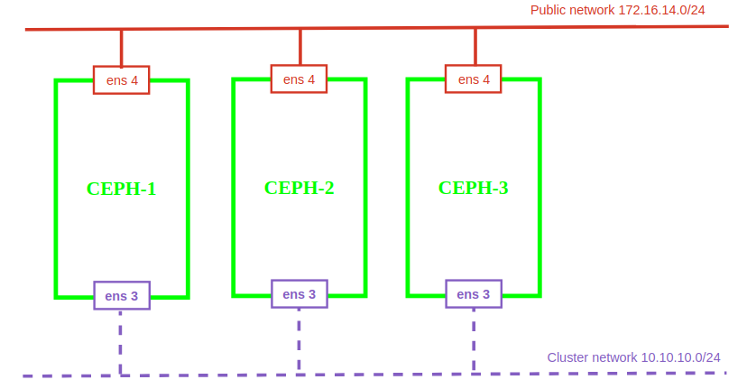

## Install ceph all in one mimic in ubuntu 16.04 by using ceph-deploy

## I. Chuẩn bị môi trường.
## 1. Config Networking
- Mô hình triển khai.
  
  

- Địa chỉ ip:
  - ceph-1: 11
  - ceph-2: 12
  - ceph-3: 13

- Thực hiện cấu hình route trong file `/etc/hosts`.

## 2. Cài NTP

- Cài gói chrony.

```
apt -y install chrony
```

- Mở file `/etc/chrony/chrony.conf` bằng vi và thêm vào các dòng sau:
Trên ceph 1 thực hiện như sau. commnet dòng sau:

```
#pool 2.debian.pool.ntp.org offline iburst
```

Thêm các dòng sau:

```
server 1.vn.poo.ntp.org iburst
server 0.asia.pool.ntp.org iburst 
server 3.asia.pool.ntp.org iburst
 
allow 10.10.10.0/24
```

Trên ceph 2 và ceph 3:

commnet dòng sau:

```
#pool 2.debian.pool.ntp.org offline iburst
```

Thêm các dòng sau:

```
server ceph1 iburst
```

- Restart dịch vụ NTP

```
service chrony restart
```

## 3. Cài ceph-deploy.
- Thực hiện trên ceph-1.
- Cài các gói bổ sung

```
apt install -y python-setuptools python-virtualenv pip
```

- clone ceph-deploy

```
git clone https://github.com/ceph/ceph-deploy.git
```

- Thực hiện cài đặt ceph-deploy

```
cd ceph-deploy
./bootstrap
```


## add user ceph-deploy.
- Thực hiện trên tất cả các node.

```sh
useradd -d /home/ceph-deploy -m ceph-deploy
passwd ceph-deploy
```

- grant permission for ceph-deploy user

```sh
echo "ceph-deploy ALL = (root) NOPASSWD:ALL" | tee /etc/sudoers.d/ceph-deploy
chmod 0440 /etc/sudoers.d/ceph-deploy
su - ceph-deploy
```

##### Thực hiện trên node ceph-1.
- Tạo alias cho ceph-deploy cmd. `vi ~/.bashrc`

```
alias ceph-deploy="/root/ceph-deploy/virtualenv/bin/ceph-deploy"
```

- Cấu hình ceph-deploy ssh đến các node khác.

```
ssh-keygen

ssh-copy-id ceph-deploy@ceph-1
ssh-copy-id ceph-deploy@ceph-2
ssh-copy-id ceph-deploy@ceph-3
```

## II. Thực hiện deploy cluster
- Thực hiện trên ceph-1.
- Tạo thư mục

```
cd ~
mkdir my-cluster
cd my-cluster
```

- Tạo new cluster

```
ceph-deploy new ceph-1 ceph-2 ceph-3
```

- Sau khi tạo mới cluster, trong thư mục hiện tại có các file sau:

```
ceph-deploy-ceph.log  ceph.conf  ceph.mon.keyring
```

- Sửa file ceph.conf với nội dung như sau:

```sh
[global]
fsid = 8c7dcf53-fc06-4cee-a858-543a5d92f783
mon_initial_members = ceph-1, ceph-2, ceph-3
mon_host = 10.10.10.11,10.10.10.12,10.10.10.13
auth_cluster_required = cephx
auth_service_required = cephx
auth_client_required = cephx

public network = 172.16.14.0/24
cluster network = 10.10.10.0/24
mon_allow_pool_delete = true
```

- Install ceph

```
ceph-deploy install --release mimic ceph-1 ceph-2 ceph-3
```

- Cấu hình MON.

```
ceph-deploy mon create-initial
```

- Tạo user admin để quản trị ceph cluster

```
ceph-deploy admin ceph-1 ceph-2 ceph-3
```

- Tạo osd
- Liệt kê các ổ cứng có trên mỗi node

```
ceph-deploy disk list ceph-1 ceph-2 ceph-3
```

- Xóa hết các dữ liệu cũ trên các ổ cứng.

```
ceph-deploy disk zap ceph-1 /dev/sdb
```

- Tạo các osd.

```sh
ceph-deploy osd create ceph-1 --data /dev/sdb
ceph-deploy osd create ceph-1 --data /dev/sdc

ceph-deploy osd create ceph-2 --data /dev/sdb
ceph-deploy osd create ceph-2 --data /dev/sdc

ceph-deploy osd create ceph-3 --data /dev/sdb
ceph-deploy osd create ceph-3 --data /dev/sdc
```

- Triển khai Ceph MGR nodes

```
ceph-deploy mgr create ceph-1
```

- Kết quả

```sh
ceph -s
  cluster:
    id:     8c7dcf53-fc06-4cee-a858-543a5d92f783
    health: HEALTH_OK
 
  services:
    mon: 3 daemons, quorum ceph-1,ceph-2,ceph-3
    mgr: ceph-1(active)
    osd: 6 osds: 6 up, 6 in
 
  data:
    pools:   0 pools, 0 pgs
    objects: 0  objects, 0 B
    usage:   6.0 GiB used, 24 GiB / 30 GiB avail
    pgs:     
```

