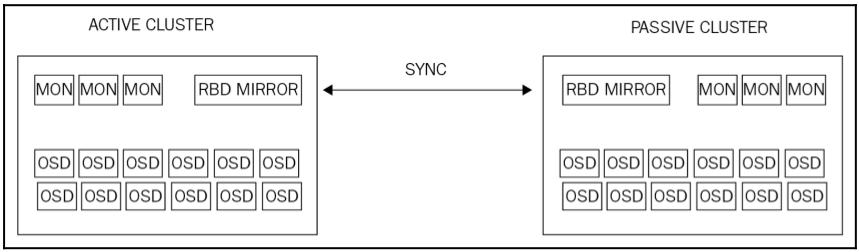

# RBD MIRRORING

RBD mirroring là sự đồng bộ các bản sao (replication) của các rbd images giữa các cluster ceph với nhau.

  

## Thực hiện cấu hình rbd mirroring.
- Thực hiện rbd mirroring với dạng active-passive: Dữ liệu sẽ được đồng bộ từ primary site sang secondary site.
- Chúng ta phải có 2 cluster ceph khác nhau: ceph và backup cluster.
- Trên backup cluster, thực hiện đổi tên file cấu hình `ceph.conf` thành `backup.conf` và file admin key `ceph.client.admin.keyring` thành `backup.client.admin.keyring`

```
~# mv /etc/ceph/ceph.client.admin.keyring /etc/ceph/backup.client.admin.keyring
~# mv /etc/ceph/ceph.conf /etc/ceph/backup.conf
```

Sau khi đổi tên file, thực hiện các cli ceph với cluster này đều phải thêm option `--cluster backup`

- 1. Tạo pool `data` trên cả 2 clusters (pool này sẽ được đồng bộ trên cả 2 cluster).

```
# Thực hiện trên ceph cluster
~# ceph osd pool create data 8 8 --cluster ceph

# Thực hiện trên backup cluster
~# ceph osd pool create data 8 8 --cluster backup
```

- 2. Tạo `client.local` user trên ceph cluster có quyền truy cập vào data pool

```
# Thực hiện trên ceph cluster
~# ceph auth get-or-create client.local mon 'allow r' osd 'allow class-read object_prefix rbd_children, allow rwx pool=data' -o /etc/ceph/ceph.client.local.keyring --cluster ceph
```

- 3. Tạo `client.remote` user trên backup cluster.

```
# Thực hiện trên backup cluster
~# ceph auth get-or-create client.remote mon 'allow r' osd 'allow class-read object_prefix rbd_children, allow rwx pool=data' -o /etc/ceph/backup.client.remote.keyring --cluster backup
```

- 4. Chuyển file cấu hình và file keyring từ cluster sang cluster khác.

```
# trên ceph cluster
~# cd /etc/ceph
/etc/ceph# ls
ceph.client.admin.keyring  ceph.client.local.keyring  ceph.conf  rbdmap  tmpEN3FPb
/etc/ceph# scp ceph.conf ceph.client.local.keyring root@<ip backup cluster>:/etc/ceph

# trên backup cluster
~# cd /etc/ceph
/etc/ceph# ls
backup.client.admin.keyring   backup.conf                ceph.conf  tmpDYx8uC 
backup.client.remote.keyring  ceph.client.local.keyring  rbdmap

/etc/ceph# scp backup.client.remote.keyring backup.conf root@<ip ceph cluster>:/etc/ceph
```

#### Cấu hình pool 
- 1. Cài đặt `rbd-mirror` lên backup cluster.

```
apt install -y rbd-mirror
```

- 2. enable pool data để sử dụng tính năng mirror

```
# trên ceph cluster
~# rbd mirror pool enable data pool --cluster ceph

# trên backup cluster
~# rbd mirror pool enable data pool --cluster backup 
```

- 3. Thêm peer cluster cho data pool

```
# Thực hiện trên backup cluster
~# rbd mirror pool peer add data client.local@ceph --cluster backup 
~# rbd mirror pool info data --cluster backup
Mode: pool
Peers: 
  UUID                                 NAME CLIENT
  34b52c2e-038c-49f5-bdfa-2686448652c3 ceph client.local
```

- 4. Tạo rbd images để kiểm tra sự đồng bộ

```
# Thực hiện tạo các image trên ceph cluster
~# rbd create image-1 --size 1024 --pool data --image-feature exclusive-lock,journaling --cluster ceph
~# rbd create image-2 --size 1024 --pool data --image-feature exclusive-lock,journaling --cluster ceph
~# rbd create image-3 --size 1024 --pool data --image-feature exclusive-lock,journaling --cluster ceph
~# rbd -p data ls --cluster ceph
image-1
image-2
image-3
```

- 5. Kiểm tra trên backup cluster

```
~# rbd mirror pool status data --cluster backup
health: OK
images: 0 total
```

Ở đây các rbd images từ ceph cluster chưa được đồng bộ sang backup cluster.

```
~# rbd-mirror -m 10.10.10.21 -d --cluster backup
2018-07-02 09:41:31.378 7fab8809f140  0 ceph version 13.2.0 (79a10589f1f80dfe21e8f9794365ed98143071c4) mimic (stable), process (unknown), pid 3115
2018-07-02 09:41:31.406 7fab8809f140  1 mgrc service_daemon_register rbd-mirror.84141 metadata {arch=x86_64,ceph_release=mimic,ceph_version=ceph version 13.2.0 (79a10589f1f80dfe21e8f9794365ed98143071c4) mimic (stable),ceph_version_short=13.2.0,cpu=Intel(R) Core(TM) i5-3320M CPU @ 2.60GHz,distro=ubuntu,distro_description=Ubuntu 16.04.4 LTS,distro_version=16.04,hostname=cluster-1,id=admin,instance_id=84141,kernel_description=#140-Ubuntu SMP Mon Feb 12 21:23:04 UTC 2018,kernel_version=4.4.0-116-generic,mem_swap_kb=1003516,mem_total_kb=997652,os=Linux}
2018-07-02 09:41:31.474 7fab8809f140  0 rbd::mirror::PoolReplayer: 0x562060ebcfc0 init_rados: reverting global config option override: mon_host: 10.10.10.21 -> 10.10.10.11,10.10.10.12,10.10.10.13
```

rbd-mirror sẽ chạy forceground.

- Kiểm tra lại các images ở trong pool data trên backup cluster.

```
~# rbd -p data ls --cluster backup
image-1
image-2
image-3
```

## tham khảo
http://www.cnblogs.com/sxwen/p/8042885.html
http://docs.ceph.com/docs/mimic/rbd/rbd-mirroring/
