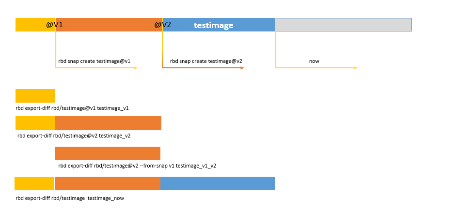

# Snapshot Block Device

Tham khảo cách sử dụng rbd để test snapshot [tại đây](./client_use_rbd.md)

## Tạo snapshot

Tạo snapshot

```sh
~# rbd snap create {pool-name}/{image-name}@{snap-name}
```

ví dụ:

```sh
~# rbd snap create rbd/disk-0@snap-0
```

List các snap của một image

```sh
~# rbd snap ls {pool-name}/{image-name}
```

ví dụ:

```sh
~# rbd snap list rbd/disk-0
SNAPID NAME     SIZE TIMESTAMP  
     8 snap-0 10 GiB Thu Jul 26 15:34:58 2018
```

Rollback

Lưu ý khi rollback: image đang được client sử dụng thì không thể thực hiện rollback. Tiến hành umount, unmap image trước khi thực hiện rollback

```sh
~# rbd snap rollback {pool-name}/{image-name}@{snap-name}
```

ví dụ:

```sh
~# rbd snap rollback rbd/disk-0@snap-0
```

- Thực hiện mount lại ở client để kiểm tra nội dung của image tại thời điểm tạo snap-0

Xóa snapshot

```sh
~# rbd snap rm {pool-name}/{image-name}@{snap-name}
```

Xóa toàn bộ snap của image

```sh
~# rbd snap purge {pool-name}/{image-name}
```

### Layering

Snapshot của iamge là read-only. Do đó, ta có thể clone snapshot ra một image mới để có thể ghi.

Trong quá trình clone, bản snapshot có thể vô tình bị xóa dẫn đến dữ liệu không được clone hoàn toàn. Do đó, trước khi clone một snapshot, hãy protect snapshot đó lại. Snapshot được protect sẽ không thể bị xóa.

PROTECTING A SNAPSHOT

```sh
~# rbd snap protect {pool-name}/{image-name}@{snapshot-name}
```

ví dụ:

```sh
~# rbd snap protect rbd/disk-0@snap-0
```

CLONING A SNAPSHOT

```sh
~# rbd clone {pool-name}/{image-name}@{snap-name} {pool-name}/{new-image-name}
```

ví dụ:

```sh
~# rbd clone rbd/disk-0@snap-0 new_pool/disk-1
```

- Chúng ta có thể liệt kê ra danh sách các bản clone của snapshot

```sh
~# rbd children {pool-name}/{image-name}@{snapshot-name}
```

ví dụ:

```sh
~# rbd children pool_demo/disk-0@snap-0
pool_1/disk-0
pool_demo/disk-1
```

Để xóa được snapshot, phải unprotect. Lưu ý: không thể unprotect với các snapshot đang có bản clone. trước khi unprotect, hãy xóa hết các bản clone của snapshot đó.

```sh
~# rbd snap unprotect {pool-name}/{image-name}@{snapshot-name}
```

## Incremental snapshot

  

Tạo image mới

```sh
~# rbd -p pool_snap create disk-0 --size 10240
```

Mount và sử dụng image này để đánh dấu các điểm snapshot

```sh
~# rbd map -t nbd pool_snap/disk-0
/dev/nbd0
~# mkfs.xfs /dev/nbd0
~# mount /dev/nbd0 /mnt
```

Tạo file và tạo snapshot

```sh
~# echo "Snap-v1" > /mnt/snap-v1
~# rbd snap create pool_snap/disk-0@v1

~# echo "Snap-v2" > /mnt/snap-v2
~# rbd snap create pool_snap/disk-0@v2

~# echo "Now" > /mnt/now
```

Kiểm tra lại các snap của disk-0

```sh
~# rbd snap ls pool_snap/disk-0
SNAPID NAME   SIZE TIMESTAMP
    34 v1   10 GiB Tue Jul 31 15:38:14 2018
    35 v2   10 GiB Tue Jul 31 15:38:33 2018
```

Export các snap

```sh
~# rbd export-diff pool_snap/disk-0@v1 snap_v1.img
~# rbd export-diff pool_snap/disk-0@v2 snap_v2.img

~# rbd export-diff --from-snap v1 pool_snap/disk-0@v2 diff_snap_v1_v2.img
```

- Trên đây đã thực hiện export ra 3 file với nội dung như sau:

  - snap_v1.img: chứa toàn bộ nội dung mà snap v1 chứa. Khi import file này vào một image khác, image đó có khả năng khổi phục lại dữ liệu giống với thời điểm tạo snap v1
  - snap_v2.img: hoàn toàn tương tự như file snap_v1.img
  - diff_snap_v1_v2.img: file này chứa nội dung khác nhau giữ 2 lần tạo snapshot v1 và v2. Khi import file này vào image khác yêu cầu phải có snapshot v1. Do đó phải import file snap_v1.img trước khi import file này.

Import các snapshot theo thứ tự vào một image khác và kiểm tra.

Tạo 1 image mới

```sh
~# rbd -p pool_snap create disk-1 --size 10240
```

Import các snapshot vào disk-1

```sh
~# rbd import-diff snap_v1.img pool_snap/disk-1
~# rbd import-diff snap_v2.img pool_snap/disk-1
~# rbd snap list pool_snap/disk-1
SNAPID NAME   SIZE TIMESTAMP
    36 v1   10 GiB Tue Jul 31 15:52:43 2018
    37 v2   10 GiB Tue Jul 31 15:54:11 2018
```

- Với cách import trên xảy ra dữ liệu thừa (2 lần snap_v1). Thay vì import file snap_v2.img, ta có thể import file `diff_snap_v1_v2.img` cũng cho kết quả tương tự. Đây là tính năng **RBD snapshot incremental**

[Tham khảo](http://www.zphj1987.com/2016/06/22/rbd%E7%9A%84%E5%A2%9E%E9%87%8F%E5%A4%87%E4%BB%BD%E5%92%8C%E6%81%A2%E5%A4%8D/)
