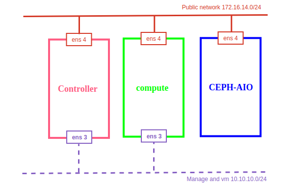

## Tích hợp ceph mimic với openstack queens

Thực hiện tích hợp với mô hình:

  

---

Cài đặt các thành phần để sử dụng ceph trên node controller.

```sh
wget -q -O- 'https://download.ceph.com/keys/release.asc' | sudo apt-key add -
echo deb https://download.ceph.com/debian-mimic/ $(lsb_release -sc) main | sudo tee /etc/apt/sources.list.d/ceph.list
apt update
apt install python-rbd ceph-common -y
```

Kiểm tra lại các gói cài đặt. Kết quả là `13.2.0` thì đúng là phiên bản mimic

```sh
~# dpkg -l | egrep -i "ceph|rados|rbd"
ii  ceph-common                         13.2.0-1xenial                              amd64        common utilities to mount and interact with a ceph storage cluster
ii  libcephfs2                          13.2.0-1xenial                              amd64        Ceph distributed file system client library
ii  librados2                           13.2.0-1xenial                              amd64        RADOS distributed object store client library
ii  libradosstriper1                    13.2.0-1xenial                              amd64        RADOS striping interface
ii  librbd1                             13.2.0-1xenial                              amd64        RADOS block device client library
ii  librgw2                             13.2.0-1xenial                              amd64        RADOS Gateway client library
ii  python-cephfs                       13.2.0-1xenial                              amd64        Python 2 libraries for the Ceph libcephfs library
ii  python-rados                        13.2.0-1xenial                              amd64        Python 2 libraries for the Ceph librados library
ii  python-rbd                          13.2.0-1xenial                              amd64        Python 2 libraries for the Ceph librbd library
ii  python-rgw                          13.2.0-1xenial                              amd64        Python 2 libraries for the Ceph librgw library
```

## Tích hợp với Glance

#### 1. Thực hiện trên node ceph

- Tạo pool images

```sh
ceph osd pool create images 64 64
```

- Tạo user cho glance

```sh
ceph auth get-or-create client.glance mon 'allow r' osd 'allow class-read object_prefix rbd_children, allow rwx pool=images' -o /etc/ceph/ceph.client.glance.keyring
```

#### 2. Thực hiện trên node controller

- Lấy keyring của client.glance từ ceph node

```sh
scp root@<ip_ceph>:/etc/ceph/ceph.client.glance.keyring /etc/ceph/
chown glance:glance /etc/ceph/ceph.client.glance.keyring
```

Cấu hình:

- Cài đặt công cụ cấu hình cho openstack nếu trên controller chưa được cài đặt

```sh
apt install -y crudini
```

```sh
crudini --set /etc/glance/glance-api.conf DEFAULT enable_v2_api true
crudini --set /etc/glance/glance-api.conf DEFAULT enable_v2_registry true
crudini --set /etc/glance/glance-api.conf DEFAULT enable_v1_api true
crudini --set /etc/glance/glance-api.conf DEFAULT enable_v1_registry true

crudini --set /etc/glance/glance-api.conf glance_store show_image_direct_url True
crudini --set /etc/glance/glance-api.conf glance_store default_store rbd
crudini --set /etc/glance/glance-api.conf glance_store stores file,http,rbd
crudini --set /etc/glance/glance-api.conf glance_store rbd_store_pool images
crudini --set /etc/glance/glance-api.conf glance_store rbd_store_user glance
crudini --set /etc/glance/glance-api.conf glance_store rbd_store_ceph_conf /etc/ceph/ceph.conf
crudini --set /etc/glance/glance-api.conf glance_store rbd_store_chunk_size 8
```

Restart service

```sh
service glance-registry restart
service glance-api restart
```

Kiểm tra kết quả

- Download image

```sh
wget http://download.cirros-cloud.net/0.3.4/cirros-0.3.4-x86_64-disk.img
```

- Tạo img mới

```sh
openstack image create "cirros-ceph" \
--file cirros-0.3.5-x86_64-disk.img \
--disk-format qcow2 --container-format bare \
--public
```

List các image

```sh
~# openstack image list
+--------------------------------------+-------------+--------+
| ID                                   | Name        | Status |
+--------------------------------------+-------------+--------+
| 42c30bd6-a103-4543-ac01-8f53ce39e958 | cirros      | active |
| 0bfd10d9-43ef-4835-8189-9ea9a9902a0e | cirros-ceph | active |
+--------------------------------------+-------------+--------+
```

show details cirros-ceph

```sh
~# openstack image show cirros-ceph
+------------------+------------------------------------------------------+
| Field            | Value                                                |
+------------------+------------------------------------------------------+
| checksum         | f8ab98ff5e73ebab884d80c9dc9c7290                     |
| container_format | bare                                                 |
| created_at       | 2018-07-16T08:52:48Z                                 |
| disk_format      | qcow2                                                |
| file             | /v2/images/0bfd10d9-43ef-4835-8189-9ea9a9902a0e/file |
| id               | 0bfd10d9-43ef-4835-8189-9ea9a9902a0e                 |
| min_disk         | 0                                                    |
| min_ram          | 0                                                    |
| name             | cirros-ceph                                          |
| owner            | fe0b8027279c4e8fb3213caf6b806395                     |
| protected        | False                                                |
| schema           | /v2/schemas/image                                    |
| size             | 13267968                                             |
| status           | active                                               |
| tags             |                                                      |
| updated_at       | 2018-07-16T08:52:50Z                                 |
| virtual_size     | None                                                 |
| visibility       | public                                               |
+------------------+------------------------------------------------------+
```

- image có id `0bfd10d9-43ef-4835-8189-9ea9a9902a0e`
- Kiểm tra image có trong images pool ở trên ceph

```sh
~# rbd -p images ls
0bfd10d9-43ef-4835-8189-9ea9a9902a0e
```

Như vậy đã thành công.

## Tích hợp với Cinder

#### 1. Tạo pool và user trên ceph cho cinder

Tạo pool

```sh
ceph osd pool create volumes 64 64
```

Tạo user cinder

```sh
ceph auth get-or-create client.cinder mon 'allow r' osd 'allow class-read object_prefix rbd_children, allow rwx pool=volumes, allow rwx pool=vms, allow rwx pool=images' -o /etc/ceph/ceph.client.cinder.keyring
```

Chuyển key sang node controller

```sh
scp /etc/ceph/ceph.client.cinder.keyring root@<ipcontroller>:/etc/ceph/
ssh <ipcontroller> sudo chown cinder:cinder /etc/ceph/ceph.client.cinder.keyring
```

Chuyển key client.cinder sang node compute-1

```sh
ceph auth get-or-create client.cinder | ssh <ipcompute-1> sudo mkdir /etc/ceph; sudo tee /etc/ceph/ceph.client.cinder.keyring
ceph auth get-key client.cinder | ssh <ipcompute-1> tee /root/client.cinder.key
```


93482749-eb41-4b30-a828-cd089f9e6141

crudini --set /etc/cinder/cinder.conf ceph_hdd volume_driver cinder.volume.drivers.rbd.RBDDriver
crudini --set /etc/cinder/cinder.conf ceph_hdd volume_backend_name ceph_hdd
crudini --set /etc/cinder/cinder.conf ceph_hdd rbd_pool volumes
crudini --set /etc/cinder/cinder.conf ceph_hdd rbd_ceph_conf /etc/ceph/ceph.conf
crudini --set /etc/cinder/cinder.conf ceph_hdd rbd_flatten_volume_from_snapshot true
crudini --set /etc/cinder/cinder.conf ceph_hdd rbd_max_clone_depth 5
crudini --set /etc/cinder/cinder.conf ceph_hdd rbd_store_chunk_size 4
crudini --set /etc/cinder/cinder.conf ceph_hdd rrados_connect_timeout -1
crudini --set /etc/cinder/cinder.conf ceph_hdd rbd_user cinder
crudini --set /etc/cinder/cinder.conf ceph_hdd rbd_secret_uuid 93482749-eb41-4b30-a828-cd089f9e6141
crudini --set /etc/cinder/cinder.conf ceph_hdd report_discard_supported true

<secret ephemeral='no' private='no'>
        <uuid>93482749-eb41-4b30-a828-cd089f9e6141</uuid>
        <usage type='ceph'>
                <name>client.cinder secret</name>
        </usage>
</secret>

virsh secret-set-value --secret 93482749-eb41-4b30-a828-cd089f9e6141 --base64 $(cat client.cinder.key)


crudini --set /etc/nova/nova.conf DEFAULT force_raw_images True
crudini --set /etc/nova/nova.conf DEFAULT disk_cachemodes writeback
crudini --set /etc/nova/nova.conf libvirt images_rbd_pool vms
crudini --set /etc/nova/nova.conf libvirt images_type rbd
crudini --set /etc/nova/nova.conf libvirt images_rbd_ceph_conf /etc/ceph/ceph.conf
crudini --set /etc/nova/nova.conf libvirt rbd_secret_uuid aaf0aa41-45c0-451b-a8f1-1b4226e7d682
crudini --set /etc/nova/nova.conf libvirt rbd_user nova